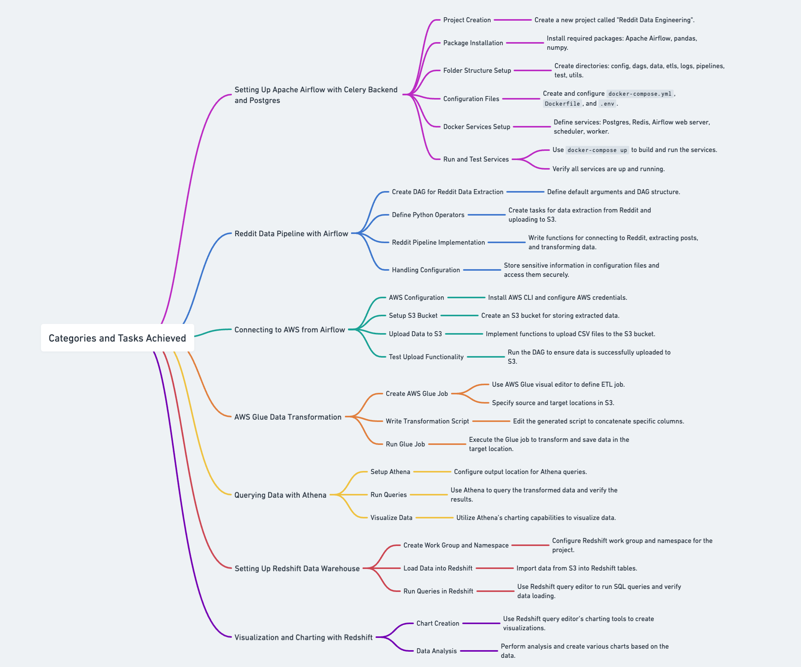

# Project Title: Reddit Data Engineering Pipeline

## Categories:

### 1. Setting Up Apache Airflow with Celery Backend and Postgres
### 2. Reddit Data Pipeline with Airflow
### 3. Connecting to AWS from Airflow
### 4. AWS Glue Data Transformation
### 5. Querying Data with Athena
### 6. Setting Up Redshift Data Warehouse
### 7. Visualization and Charting with Redshift

<!-- Images in Sequence with Borders and Bold Black Separation Lines -->

  
  

  
  

  
  
  

  
  

  

  

  

## Categories and Tasks Achieved:

### 1. Setting Up Apache Airflow with Celery Backend and Postgres
- **Project Creation**:
  - Create a new project called "Reddit Data Engineering".
- **Package Installation**:
  - Install required packages: Apache Airflow, pandas, numpy.
- **Folder Structure Setup**:
  - Create directories: config, dags, data, etls, logs, pipelines, test, utils.
- **Configuration Files**:
  - Create and configure `docker-compose.yml`, `Dockerfile`, and `.env`.
- **Docker Services Setup**:
  - Define services: Postgres, Redis, Airflow web server, scheduler, worker.
- **Run and Test Services**:
  - Use `docker-compose up` to build and run the services.
  - Verify all services are up and running.

### 2. Reddit Data Pipeline with Airflow
- **Create DAG for Reddit Data Extraction**:
  - Define default arguments and DAG structure.
- **Define Python Operators**:
  - Create tasks for data extraction from Reddit and uploading to S3.
- **Reddit Pipeline Implementation**:
  - Write functions for connecting to Reddit, extracting posts, and transforming data.
- **Handling Configuration**:
  - Store sensitive information in configuration files and access them securely.

### 3. Connecting to AWS from Airflow
- **AWS Configuration**:
  - Install AWS CLI and configure AWS credentials.
- **Setup S3 Bucket**:
  - Create an S3 bucket for storing extracted data.
- **Upload Data to S3**:
  - Implement functions to upload CSV files to the S3 bucket.
- **Test Upload Functionality**:
  - Run the DAG to ensure data is successfully uploaded to S3.

### 4. AWS Glue Data Transformation
- **Create AWS Glue Job**:
  - Use AWS Glue visual editor to define ETL job.
  - Specify source and target locations in S3.
- **Write Transformation Script**:
  - Edit the generated script to concatenate specific columns.
- **Run Glue Job**:
  - Execute the Glue job to transform and save data in the target location.

### 5. Querying Data with Athena
- **Setup Athena**:
  - Configure output location for Athena queries.
- **Run Queries**:
  - Use Athena to query the transformed data and verify the results.
- **Visualize Data**:
  - Utilize Athena’s charting capabilities to visualize data.

### 6. Setting Up Redshift Data Warehouse
- **Create Work Group and Namespace**:
  - Configure Redshift work group and namespace for the project.
- **Load Data into Redshift**:
  - Import data from S3 into Redshift tables.
- **Run Queries in Redshift**:
  - Use Redshift query editor to run SQL queries and verify data loading.

### 7. Visualization and Charting with Redshift
- **Chart Creation**:
  - Use Redshift query editor’s charting tools to create visualizations.
- **Data Analysis**:
  - Perform analysis and create various charts based on the data.
